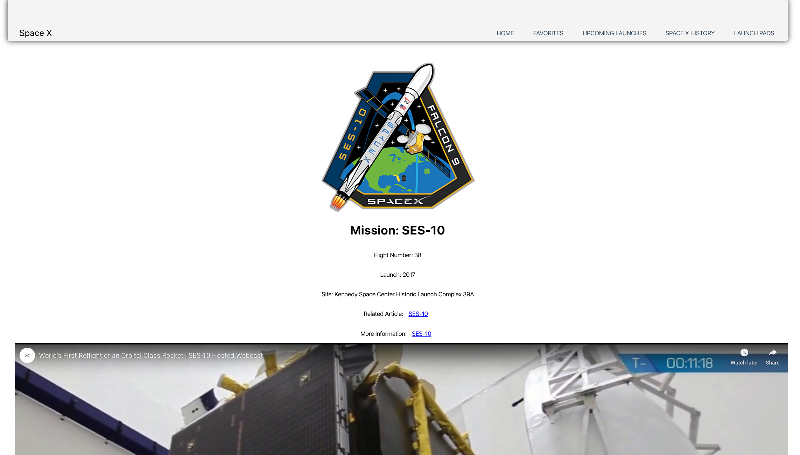
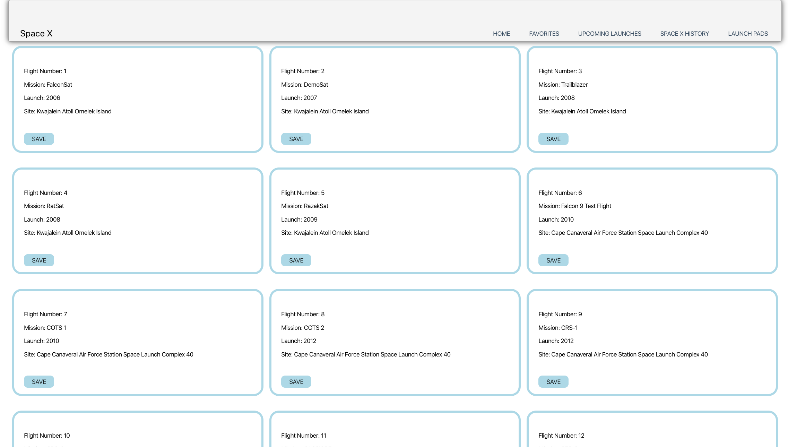
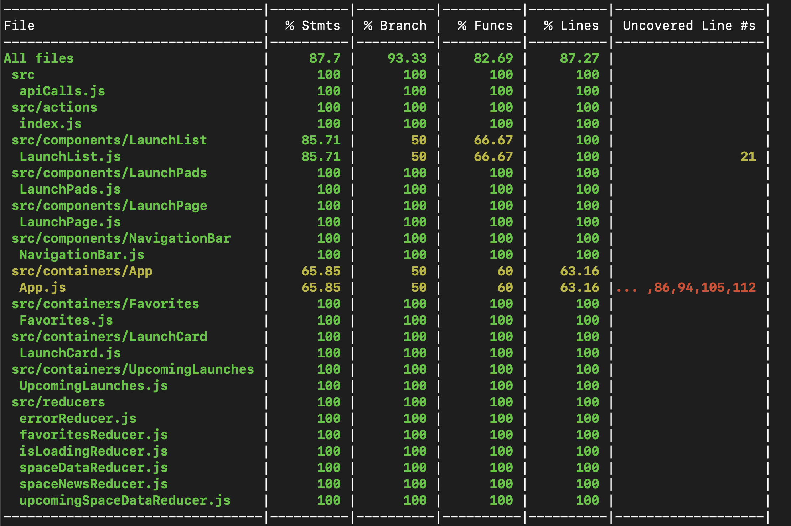

# SpaceX

- Fetch API from using [SpaceX API](https://docs.spacexdata.com/?version=latest)
- View all launches and upcoming launches
- Information provided include launch site, year launch, mission name, link to a related article, link for more information of the mission, patch image of the mission, and a YouTube video embedded for the launch
- User can favorite their favorite launches
- SpaceX History with the news is coming up in the future iterations
- Launch Pads information is coming up in the future iterations

## Built With

- React
- Redux
- Test with Jest and Enzyme
- Unit Test Coverage

## [Peerat Sukcharoenyingyong](https://github.com/peeratmac)

### Setup

- Clone this repo to your local machine
- Run `npm install`
- Run `npm start`
- Navigate to http://localhost:3000/ in your browser

### Test Coverage

